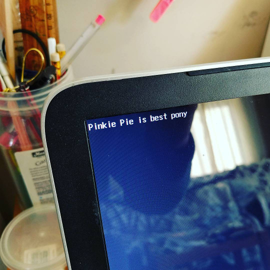

# Akira

Akira is my toy OS. There's not much stuff here right now, but feel free to look through & learn from what's here!

## Building

You will need GNU Make and a recent nightly version of the Rust compiler.

### Step 1: install an EFI cross toolchain

Since UEFI uses a funny executable format (PE subsystem 10), you'll need to install a custom linker to build programs for it.

[Grab the latest version of binutils][binutils], and `./configure` it with `--target=x86_64-efi-pe`. Then install the result somewhere in your `$PATH`.

Arch Linux users can try [building from the AUR][binutils-aur] instead, but note that this version is (as of 2016-06-02) out of date.

[binutils]: https://www.gnu.org/software/binutils/
[binutils-aur]: https://aur.archlinux.org/packages/x86_64-efi-pe-binutils/

### Step 2: grab the code

Grab all the code using this command:

    git clone --recursive https://github.com/lfairy/akira

### Step 3: build the thing

To build the system, simply type `make`. This will build the EFI executable and generate an ISO image (`akira.iso`).

You can then test the result using any reputable UEFI implementation. If you're using [VirtualBox][virtualbox], be sure to tick the "Enable EFI" option in the settings.

[virtualbox]: https://www.virtualbox.org/

## Documentation

The code includes a tiny bit of documentation. To read it, run `make doc` and browse `target/x86_64-efi-pe/doc`.
